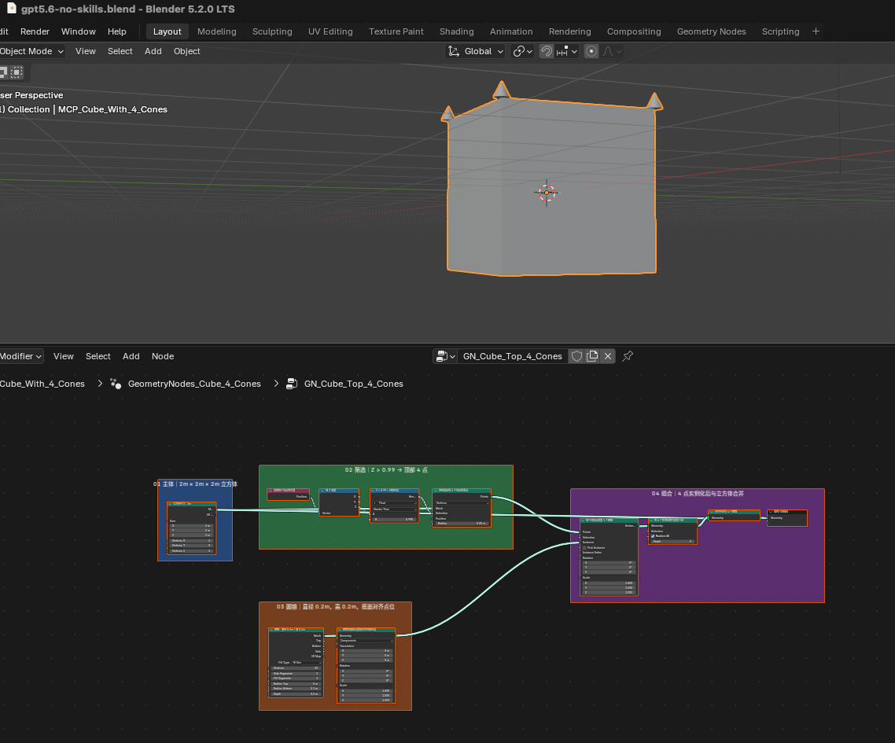
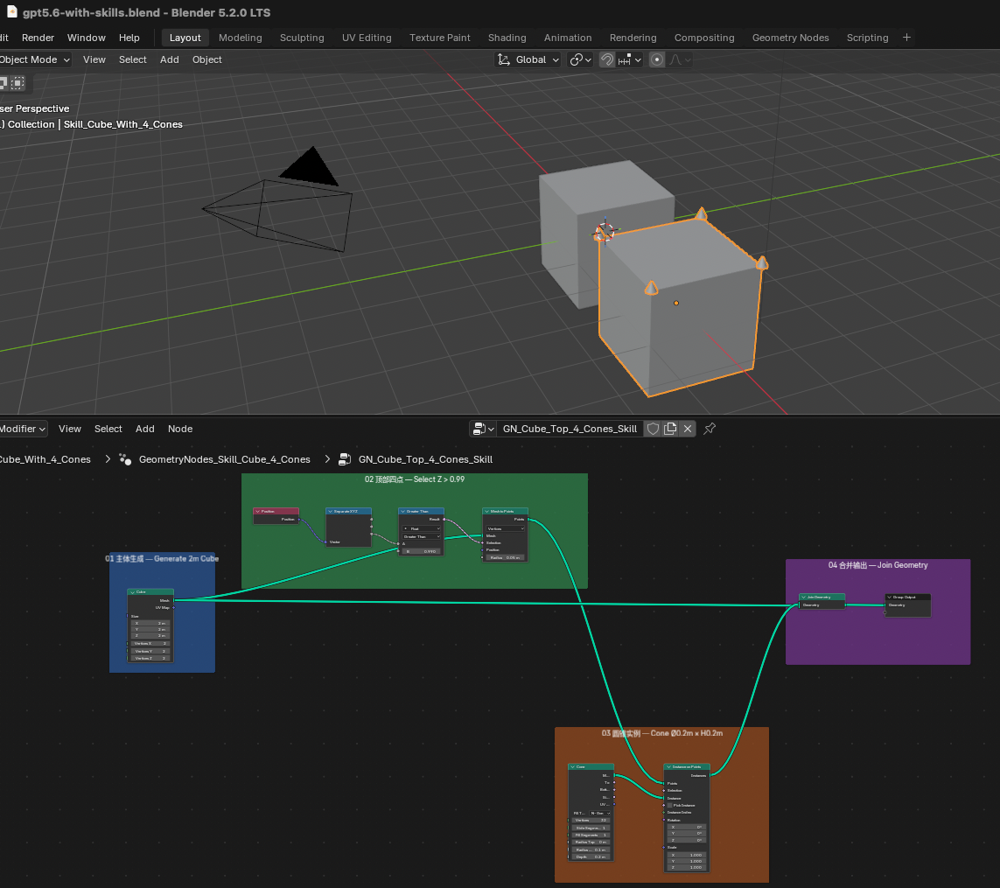

English | [简体中文](README.zh-CN.md)

# NodeCue Blender Node Skills

An agent skill that teaches AI coding agents to **build Blender Geometry Nodes graphs correctly — and explain them so you can learn from the result**: verified node and socket identities, proven graph patterns, readback-based self-repair, and teaching annotations in the language of your prompt.

## Why install this?

Same task, same agent, same model — once without the skill, once with it:

> *(Add a 2 m cube to the scene. At each of its top 4 vertices, add a cone 0.2 m tall and 0.2 m in diameter.)*

| Without the skill (Codex app, gpt-5.6) | With the skill (Codex app, gpt-5.6) |
|---|---|
|  |  |
| 11 nodes, renamed + relabeled, leftover `Realize Instances` | 9 nodes, default names, 4 bilingual frames |

*The prompt for the left column also had to spell out: "Use frames to give a functional explanation of the nodes." The skill adds teaching frames automatically — nothing extra to ask for.*

Both columns are the same agent (Codex app, gpt-5.6, extra-high reasoning) through Blender MCP, once told not to use any skill and once with this skill — geometry is correct both times; this is a strong model, so the difference is what gets left behind:

- **Node names**: every node renamed and relabeled with an explanation (`Cube_2m`, "读取每个顶点的位置", "Z > 0.99 = 顶部顶点"...) vs. default Blender names (`Position`, `Compare`, `Cone`...). Renaming breaks the link between the graph, Blender's UI, and any tutorial that assumes default names.
- **Where the teaching lives**: explanations smeared across individual node labels vs. collected into teaching frames ("02 顶部四点 — Select Z > 0.99").
- **Leftover node**: a `Realize Instances` left sitting in the final graph vs. used only to verify the count (4 cones), then removed.
- **Graph size**: 11 nodes / 11 links vs. 9 nodes / 9 links for the identical result.
- **Cost**: 4 MCP calls (~4m17s) vs. 7 MCP calls (~5m46s) — the extra readback-verify-repair loop isn't free.

On a strong model, the skill isn't the difference between working and broken. It's standing convention (default names, frames, bilingual labels) and verification discipline (check before claiming done) instead of you re-typing "please explain with frames" and re-checking the result yourself, every time.

## Install

One command, works across Claude Code, Codex, Cursor, and other agents (via the open [skills CLI](https://github.com/vercel-labs/skills)):

```bash
npx skills add nodecue/blender-node-skills
```

Alternatives: Claude Code plugin (`/plugin marketplace add nodecue/blender-node-skills`, then `/plugin install blender-node-skills@nodecue`), or clone and copy `skills/geometry-nodes/` into your agent's skills directory.

## Connecting to Blender

The skill works with whatever Blender access path your agent has:

- **Blender's official [MCP server](https://www.blender.org/lab/mcp-server/)** from Blender Lab (bundled from Blender 5.2 LTS, available as an add-on) — preferred
- The community [blender-mcp](https://github.com/ahujasid/blender-mcp) project

## Scope and Accuracy

- **Geometry Nodes only, Blender 4.5 LTS through 5.2.** Node availability and socket layouts are recorded per entry with `Version`, `Compatibility`, and `Evidence` notes, established from the versioned Blender manuals and confirmed by live readback on Blender 4.5.12 and 5.2.0. Differences between 5.0 and 5.1 have not yet been systematically audited. Shader Nodes and Compositing Nodes are planned as sibling skill folders.
- **Annotations follow your prompt's language** (Chinese prompt → Chinese teaching notes); Blender terms always stay in English so they map to the UI and tutorials.
- **Results can still be wrong.** The skill sharply reduces invented node names and dropped requirements, but model quality matters. Inspect the graph in Blender before relying on it, and report failures.

## Feedback

Open an issue with the `Skill feedback` template when an agent gets a Blender node task wrong after reading this skill. Include the prompt, agent/tool, model, and what the graph got wrong. No API keys, private asset-library paths, or unreleasable `.blend` files in public issues.

## License

MIT — see [LICENSE](LICENSE). Node behavior in the rules is verified against the [Blender Manual](https://docs.blender.org/manual/en/latest/) (CC-BY-SA 4.0).
